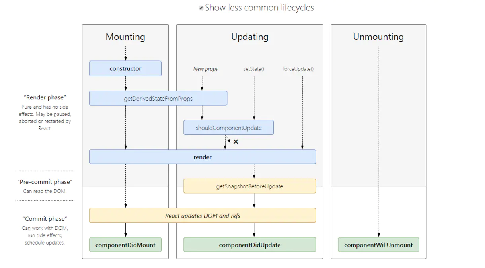

# 1. 生命周期

> https://juejin.cn/post/6844903922453200904#heading-3
> 

1. 挂载阶段:
   1. constructor: 声明state, 或者给函数bind.(this)
   2. getDerivedStateFromProps: `static getDerivedStateFromProps(nextProps, prevState)`, 获取新props, 和旧的state
   3. render: render函数是纯函数，只返回需要渲染的东西，不应该包含其它的业务逻辑,可以返回原生的DOM、React组件、Fragment、Portals、字符串和数字、Boolean和null等内容
   4. componentDidMount: 组件装载后渲染,获取到DOM节点并操作,订阅一些事件，但是要记得在componentWillUnmount() 钩子里面清除，和`vue setInterval`一个道理
2. 更新阶段:
   1. getDerivedStateFromProps:和挂载一样
   2. shouldComponentUpdate: `shouldComponentUpdate(nextProps, nextState)`, 更新之前，给你新的props和state, 返回值可以限制组件是否render。
   3. render
   4. getSnapshotBeforeUpdate: getSnapshotBeforeUpdate(prevProps, prevState), 书面上一样，获取更新前的快照，render后，这个函数有一个返回值，会作为第三个参数传给`componentDidUpdate`。 主要和`componentDidUpdate`配合使用,  before the DOM is updated
   5. componentDidUpdate: `componentDidUpdate(prevProps, prevState, snapshot)` 组件更新完成。the DOM is updated
3. 卸载阶段:
   1. componentWillUnmount: 当组件销毁前调用。清除一些定时器，取消网络请求，清理无效的DOM元素等垃圾清理工作。

# 2. React中的合成事件是什么？
1. 减少了内存的消耗(有一个自己的池子)
2. React 通过将事件 normalize 以让他们在不同浏览器中拥有一致的属性。
3. 如果需要更底层的事件 `nativeEvent`
4. 事件都委托到 `document` 上

# 3. setState到底是异步还是同步?
1. `setState`只在`合成事件`和`钩子函数`中是“异步”的，在`原生事件`和`setTimeout` 中都是同步的。
2. `isBatchingUpdates`， 每次setState都会判断
   1. true 表明`现在正处于批量更新过程或更新组件过程中`, 排队
   2. false 立即执行
3. 为了更好的实现批量更新。不然每更改一次就要re-render。消耗太大。

- 批量操作，和`vue.nextTick`类似，缓存区

# 4. React组件通信如何实现?
1. 父->子: props ref
2. 子->父: props 回调
3. 兄弟组件通信: 找共同父亲
4. 跨级通讯: context
5. eventBus
6. redux...

# 5. React如何进行组件/逻辑复用?
> https://juejin.cn/post/6844903922453200904#heading-9


- Hoc
- render props
- react hooks
- Mixin(废弃)

- `HOC` vs `mixins` 的优势
  1. `HOC`从外部传入props, `mixins`修改state
  2. `HOC`树结构，`mixins`平级关系，多个mixins修改，维护复杂。
- `HOC` 劣势
  1. Wrapper Hell: HOC可能出现多层包裹组件的情况,多层抽象同样增加了复杂度和理解成本
  2. 不可见性: 不知道外层做了什么。
- `Render Props` 劣势
  1. 使用繁琐
  2. 嵌套过深
- `React Hooks`优点
  1. 简洁: React Hooks解决了HOC和Render Props的嵌套问题,更加简洁
  2. 解耦: React Hooks可以更方便地把 UI 和状态分离,做到更彻底的解耦
  3. 组合: Hooks 中可以引用另外的 Hooks形成新的Hooks,组合变化万千
  4. 函数友好: React Hooks为函数组件而生,从而解决了类组件的几大问题
     1. this 指向容易错误
     2. 分割在不同声明周期中的逻辑使得代码难以理解和维护
     3. 代码复用成本高（高阶组件容易使代码量剧增）
- `React Hooks` 缺点
  1. 在闭包场景可能会引用到旧的state、props值
  2. 额外的学习成本
  3. `React.memo`:`React.memo(Component, [areEqual(prevProps, nextProps)]);` 会记忆，如果返回true就使用memo. 不更新。
     1. 和`shouldComponentUpdate` 拿不到(state change)


# 6.fiber,  Time Slice, Suspense API
1. Fiber 
  1. 是什么?
    1. 为了解决层级过深, 更新组件，耗时，页面卡顿
  2. 具体拆分
    1. Scheduler 
      1. 检测 此次 eventloop 有没有中剩余时间, if yes && >=  5ms 执行Reconciler
        1. requestIdleCallback
          1. 介绍: 
            1. 通知主线程，不忙的时候告诉我，我有几个不太忙的事情做。
          2. 因为有兼容性问题, react 自己实现了一套。
            1. MessageChannel :  postMessage & onMessage（在下一次eventLoop 执行
            2. requestAnimationFrame : 获取当前帧开始时间 + 16.66ms  === 当前帧结束时间
            3. 当前帧结束时间 - 当前帧渲染花费的时间 === 剩余时间
          3. 新版 5ms eventloop
    2. Reconciler  将递归变成循环 - 异步可被中断
      1. 可能因为其他原因被中断
        1. 当前帧没有剩余时间
        2. 有其他更高优任务需要先更新
      2. 导致 componentWill X 废弃, 因为中断，不知道要触发几次。
      3. 有两套🌲, 互相引用
        1. workInProgressTree 计算更新, alternate指向fiber树的同等节点。
        2. fiber🌲 对比树 和真实dom对应
    3. Renderer

# 7. hook 常用
useState、useEffect、useCallback、useMemo、useRef, 以及自定义hook
- `useMemo` 相当于 `vue computed`
- `useCallback(fn, deps)` 相当于 `useMemo(() => fn, deps)`
  - `re-render` 时不会重新计算
  - `useCallback` 缓存事件处理函数
   ```js
      const renderButton = useCallback(
         () => (
               <Button type="link">
                  {buttonText}
               </Button>
         ),
         [buttonText]    // 当buttonText改变时才重新渲染renderButton
      );
   ```
  - `useMemo` 缓存二次计算的结果
   ```js
      // 仅当num改变时才重新计算结果
      const result = useMemo(() => {
         for (let i = 0; i < 100000; i++) {
            (num * Math.pow(2, 15)) / 9;
         }
      }, [num]);
   ```
# 8.怎么解决 useState 闭包问题
```Javascript
function App(){
    const [count, setCount] = useState(1);
    useEffect(()=>{
        setInterval(()=>{
            console.log(count)
        }, 1000)
    }, [])
    function click(){ setCount(2) }
}
```
1. 原因
   1. `count` 一直为1, 因为set导致render, `useEffect []` 不会执行。
2. 解决
   1. [] 加依赖
   2. 使用ref
   3. 使用对象(不推荐)

# 9. Flux、Redux、MobX、Vuex、React-redux、Redux-thunk、Redux-saga、Dva
> https://zhuanlan.zhihu.com/p/53599723
1. Flux
   1. 可以为多个`store`,
   2. `Dispatcher` 触发所有 `store` 的 `action` 修改`state`
   3. 最原始的 数据管理
2. Redux
   1. 单一 `store`
   2. 每次`Reducer`, 都是赋值`新`的`state`.
   3. `dispatch`更新，通知`listen`. `subscribe` 订阅 push listens数组里面
3. MobX
   1. 单一 `store`
   2. 可以直接修改`state`
   3. store里面的state可以修改
   4. 收集依赖，监听，派发
4. Vuex
   1. 单一 `store`
   2. 不能直接修改`state`, 要通过`mutation`
   3. 收集依赖，修改, 触发 派发函数
5. React-redux
   1. connect 方法把 react和redux链接在一起
   2. Provider: Provider的作用是从最外部封装了整个应用，并向connect模块传递store
   3. connect: 负责连接React和Redux
6. Redux-thunk Redux-promise
   1. 异步中间件, 使`action` 内变成函数。
7. Redux-saga
   1. `Generator`函数, 使能异步，可以multify-thread
8. Dva
   1. React-redux & Redux-saga结合体

# 10.userReducer 和 redux 好在哪
> https://zhuanlan.zhihu.com/p/66020264
- 相同点
  1. 统一 store 数据管理
  2. action
  3. reducer
- 不同点
  1. useReducer 不需要依赖注入，上手难度低
  2. redux 触发state改变，去通知组件，而useReducer 则是一对一触发
  3. useReducer 不支持 middleware

# 11. Vue 和 react 做比较
1. 思想
   1. vue 双向数据流, 语法糖多
   2. react 单项数据流，语法糖少
2. 生态
   1. PC vue 生态没有 react 好 antd
   2. Wap  开发会比较快。
3. diff
   1. vue 优化能更多一些,
4. vue 轻量化，高性能，快速
5. react 后台数据量大，fiber 大数据更新。


# 12. 受控组件
> https://segmentfault.com/a/1190000022872991v
1. 受控组件
   1. `onChange={this.handleChange}`
2. 非受控组件
   1. `ref={username=>this.username=username}`