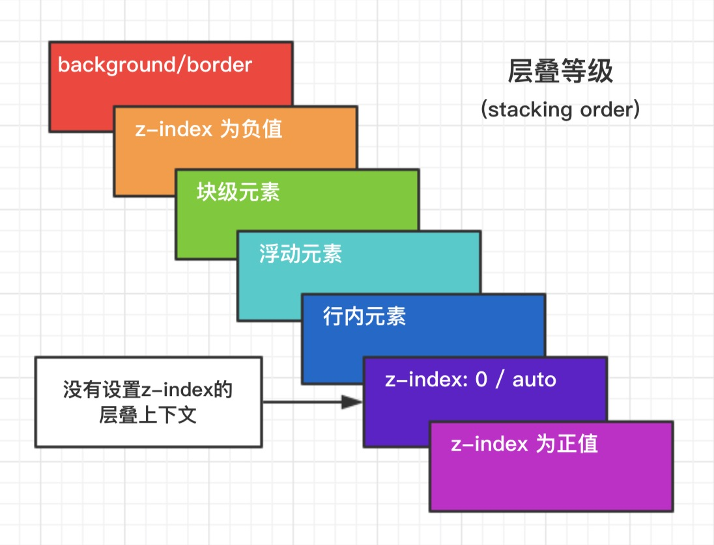

# 1.盒模型
页面渲染时，dom 元素所采用的 布局模型，可用 box-sizing 来设置。
1. content-box (W3C 标准盒模型) || 元素所占的宽度 = margin(l+r) + padding(l+r) + border(l+r) + width
2. border-box (IE 盒模型) || 元素所占的宽度 = margin(l+r) + width
3. padding-box
4. margin-box (浏览器未实现)


# 2.Css选择器的优先级
- !important > 行内样式 > #id > .class > tag > * > 继承 > 默认
- 选择器 从右往左 解析(更快)


# 3.link和@import的区别
1. `@import`只在IE 5以上才能识别，而`link`是XHTML标签，无兼容问题。
2. `link`可以使用 js 动态引入，`@import`不行
3. 当解析到`link`时，页面会同步加载所引的 css，而`@import`所引用的 css 会等到页面加载完才被加载
4. `link`方式的样式权重高于`@import`的权重。
5. `link`功能较多，可以定义 RSS，定义 Rel 等作用，而`@import`能用于加载 css

# 4.层叠上下文
元素提升为一个比较特殊的图层，在三维空间中 (z轴) 高出普通元素一等。
- 触发条件
  - 根层叠上下文(html)
  - position
  - css3属性
    - flex
    - transform
    - opacity
    - filter
    - will-change
    - -webkit-overflow-scrolling
- 层叠等级：层叠上下文在z轴上的排序
  - 在同一层叠上下文中，层叠等级才有意义
  - z-index的优先级最高



# 5.居中布局

- 水平居中
  - 行内元素: text-align: center
  - 块级元素: margin: 0 auto
  - absolute + transform
  - flex + justify-content: center
- 垂直居中
  - line-height: height
  - absolute + transform
  - flex + align-items: center
  - table
- 水平垂直居中
  - absolute + transform
  - flex + justify-content + align-items

# 6.去除浮动影响，防止父级高度塌陷
- 通过增加尾元素清除浮动
  - 尾类元素:after { clear: both }
  - <div style="clear:both;"></div>
- 创建父级 BFC
- 父级设置高度

# 7.BFC
块级格式化上下文，是一个独立的渲染区域，让处于 BFC 内部的元素与外部的元素相互隔离，使内外元素的定位不会相互影响

触发条件
1. 根元素 html
2. position: absolute/fixed
3. display: inline-block / table
4. float 元素
5. ovevflow !== visible

应用
1. 阻止margin重叠
2. 可以包含浮动元素 —— 清除内部浮动(清除浮动的原理是两个div都位于同一个 BFC 区域之中)
3. 自适应两栏布局
4. 可以阻止元素被浮动元素覆盖

# 8.Flex - 九宫格布局
```Css
.father {
  display: flex;
  flex-wrap: wrap;
  justify-content: space-around;
}
.child {
  width: 30%;
}
```

# 9.Flex - Flex-shrink flex-basis
- shrink是“收缩”的意思，flex-shrink主要处理当flex容器空间不足时候，单个元素的收缩比例。 默认值: 1; 0则不收缩
- flex-basis定义了在分配剩余空间之前元素的默认大小。相当于对浏览器提前告知：浏览器兄，我要占据这么大的空间，提前帮我预留好。 默认值auto

# 10.Flex - grid
> https://www.zhangxinxu.com/wordpress/2018/11/display-grid-css-css3/

总结 table Css化 新增属性

# 11.1px问题
> https://juejin.cn/post/6844903877947424782#heading-12

目前用 flexible 插件已实现// 通过视图缩小到dpr的比例，使视图能最大展现像素点
```Javascript
<meta name="viewport" content="width=device-width,initial-scale=1,user-scalable=no">
```

# 12.Rem方案和vw方案优缺点

- rem: 根据设置根元素的font-size, 来计算
  - 缺点: 要用JS和CSS相结合
- vw: 根据视图宽度来计算


# 13.重绘(repaint) 回流(reflow)(重排)

当元素的样式发生变化时，浏览器需要触发更新，重新绘制元素。这个过程中，有两种类型的操作，即重绘与回流。

- 重绘(repaint): 当元素样式的改变不影响布局时，浏览器将使用重绘对元素进行更新，此时由于只需要UI层面的重新像素绘制，因此 损耗较少
- 回流(reflow): 当元素的尺寸、结构或触发某些属性时，浏览器会重新渲染页面，称为回流。此时，浏览器需要重新经过计算，计算后还需要重新页面布局，因此是较重的操作。会触发回流的操作:
  - 页面初次渲染
  - 浏览器窗口大小改变
  - 元素尺寸、位置、内容发生改变
  - 元素字体大小变化
  - 添加或者删除可见的 dom 元素
  - 激活 CSS 伪类（例如：:hover）
  - 查询某些属性或调用某些方法
    - clientWidth、clientHeight、clientTop、clientLeft
    - offsetWidth、offsetHeight、offsetTop、offsetLeft
    - scrollWidth、scrollHeight、scrollTop、scrollLeft
    - getComputedStyle()
    - getBoundingClientRect()
    - scrollTo()

回流必定触发重绘，重绘不一定触发回流。重绘的开销较小，回流的代价较高。

最佳实践:
- css
  - 避免使用table布局
  - 将动画效果应用到position属性为absolute或fixed的元素上
- javascript
  - 避免频繁操作样式，可汇总后统一 一次修改
  - 尽量使用class进行样式修改
  - 减少dom的增删次数，可使用 字符串 或者 documentFragment 一次性插入
  - 极限优化时，修改样式可将其display: none后修改
  - 避免多次触发上面提到的那些会触发回流的方法，可以的话尽量用 变量存住

# 14.如何实现宽高比固定4 : 3（仅用css）
> https://juejin.cn/post/6844904070679887886

- padding-bottom: 父级固定宽度，子级height:0, width: 100%, padding-bottom: 75%;
- aspect-ratio: 16/9; 兼容不好 https://caniuse.com/?search=aspect-ratio

# 15.CSS预处理
CSS预处理器的原理: 是将类 CSS 语言通过 Webpack 编译 转成浏览器可读的真正 CSS。在这层编译之上，便可以赋予 CSS 更多更强大的功能，常用功能:

- 嵌套
- 变量
- 循环语句
- 条件语句
- 自动前缀
- 单位转换
- mixins复用

# 16.CSS动画
- transition: 过渡动画
  - transition-property: 属性
  - transition-duration: 间隔
  - transition-timing-function: 曲线
  - transition-delay: 延迟
  - 常用钩子: transitionend
- animation / keyframes
  - animation-name: 动画名称，对应@keyframes
  - animation-duration: 间隔
  - animation-timing-function: 曲线
  - animation-delay: 延迟
  - animation-iteration-count: 次数
    - infinite: 循环动画
  - animation-direction: 方向
    - alternate: 反向播放
  - animation-fill-mode: 静止模式
    - forwards: 停止时，保留最后一帧
    - backwards: 停止时，回到第一帧
    - both: 同时运用 forwards / backwards
  - 常用钩子: animationend
- 动画属性: 尽量使用动画属性进行动画，能拥有较好的性能表现
  - translate
  - scale
  - rotate
  - skew
  - opacity
  - color