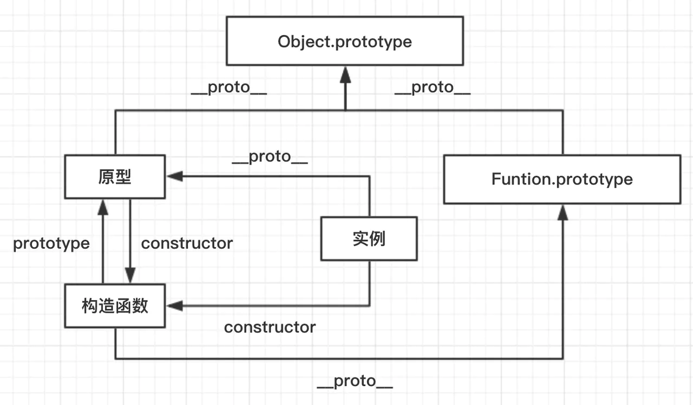
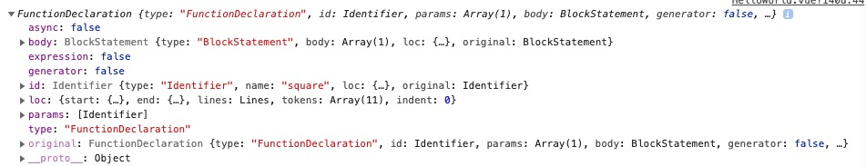

# 1.原型/构造函数/实例
https://www.cnblogs.com/wangfupeng1988/p/3977924.html
https://github.com/xd-tayde/blog/blob/master/interview-1.md

- 原型(prototype): 一个简单的对象用于实现对象的继承，可以理解为对象的爹，显式原型 prototype 隐式子 **proto**
- 构造函数(constructor): 可以通过 new 来新建一个 对象实例的函数, 构造函数可以通过 prototype 指向原型
- 实例(instance): 通过构造函数和 new 创建出来的对象，便是实例。 实例通过**proto**指向原型，通过 constructor 指向构造函数。

```JavaScript
实例.__proto__ === 原型

原型.constructor === 构造函数

构造函数.prototype === 原型

// 这条线其实是是基于原型进行获取的，可以理解成一条基于原型的映射线
// 例如:
// const o = new Object()
// o.constructor === Object   --> true
// o.__proto__ = null;
// o.constructor === Object   --> false
// 注意: 其实实例上并不是真正有 constructor 这个指针，它其实是从原型链上获取的
//      instance.hasOwnProperty('constructor') === false
实例.constructor === 构造函数

```

图片理解


# 2.原型链

原型链是由原型对象组成，每个对象都有 **proto** 属性，指向了创建该对象的构造函数的原型，**proto** 将对象连接起来组成了原型链。是一个用来实现继承和共享属性的有限的对象链。

- 属性查找机制: 当查找对象的属性时，如果实例对象自身不存在该属性，则沿着原型链往上一级查找，找到时则输出，不存在时，则继续沿着原型链往上一级查找，直至最顶级的原型对象 Object.prototype，如还是没找到，则输出 undefined；
- 属性修改机制: 只会修改实例对象本身的属性，如果不存在，则进行添加该属性，如果需要修改原型的属性时，则可以用: b.prototype.x = 2；但是这样会造成所有继承于该对象的实例的属性发生改变。

# 3.instanceof

instanceof 运算符用于测试构造函数的 prototype 属性是否出现在对象原型链中的任何位置

```
instance.[__proto__...] === constructor.prototype
```

https://segmentfault.com/a/1190000018874474

# 4.new 运算符的执行过程

```JavaScript
new People('12') = {
  var obj = {} 或者 var obj = new Object() // 创建一个空对象;
  obj.__proto__ = People.prototype // 将该隐式原型原型指向构造函数显式原型，建立对象和原型直接的对应关系。
  People.call(obj, "12") // 将构造函数中this指向创建的obj对象，并传入参数"12"
  return obj // 返回obj对象，person指向创建的obj对象(对象类型赋值为按引用传递，obj与person指向同一个对象)
}
```

# 5.执行上下文

执行上下文可以简单理解为一个对象的进栈道、出栈的过程

- 包含 3 个部分
  - 变量对象, 变量、函数表达式——变量声明，默认赋值为 undefined；`变量提升`
  - this——赋值；
  - 作用域链(词法作用域)
- 代码段分为 3 种类型
  - 全局代码
  - 函数体
  - eval 代码
- 代码执行过程:
  - 创建 全局上下文 (global EC)
  - 全局执行上下文 (caller) 逐行 自上而下 执行。遇到函数时，函数执行上下文 (callee) 被 push 到执行栈顶层
  - 函数执行上下文被激活，成为 active EC, 开始执行函数中的代码，caller 被挂起
  - 函数执行完后，callee 被 pop 移除出执行栈，控制权交还全局上下文 (caller)，继续执行

## 变量对象

变量对象，是执行上下文中的一部分，可以抽象为一种 数据作用域，其实也可以理解为就是一个简单的对象，它存储着该执行上下文中的所有 变量和函数声明

## 作用域

执行上下文中还包含作用域链。理解作用域之前，先介绍下作用域。作用域其实可理解为该上下文中声明的 变量和声明的作用范围。

- `创建这个函数的那个作用域中取值——是“创建”，而不是“调用”，切记切记`。
- 声明提前: 一个声明在函数体内都是可见的, 函数优先于变量
- 非匿名自执行函数，函数变量为`只读`状态，无法修改
  ```JavaScript
    let foo = function(){console.log(1)}
    (function foo(){
      foo = 10 // 由于foo 在函数中 `只读` 状态，赋值无效
      console.log(foo)
    }())
    // 结果打印: f foo(){foo=10;console.log(foo)}
  ```

## 作用域链

我们知道，我们可以在执行上下文中访问到父级甚至全局的变量，这便是作用域链的功劳。作用域链可以理解为一组对象列表，包含 父级和自身的变量对象，因此我们便能通过作用域链访问到父级里声明的变量或者函数。

由两部分组成

- 父级的 scope
- AO: 自身的变量

自上而下的作用域链

# 6.闭包

闭包属于一种特殊的作用域，称为 `静态作用域`。它的定义可以理解为: `父函数被销毁` 的情况下，返回出的`子函数`的[[scope]]中仍然保留着父级的单变量对象和作用域链，因此可以继续访问到父级的变量对象，这样的函数称为闭包。

- 函数作为返回值
  ```JavaScript
    function makeFunc() {
      var name = "Mozilla";
      function displayName() {
          alert(name);
      }
      return displayName;
    }
    var myFunc = makeFunc(); // 执行完成这里按理说要销毁makeFunc作用域的，但是返回的displayName引用了 makeFunc作用域 所以不能删除，导致一直占用内存
    myFunc();
  ```
- 函数作为参数传递
  ```JavaScript
    var max = 10
    var fn = function(x){
      console.log(x + max) // 25 变量取自声明，切记切记
    }
    (function(f){
      var max = 100;
      f(15)
    }(fn))
  ```

解决:

- 变量可以通过 函数参数的形式 传入，避免使用默认的[[scope]]向上查找
- 使用 setTimeout 包裹，通过第三个参数传入
- 使用 块级作用域，让变量成为自己上下文的属性，避免共享

# 7.this/call/apply/bind

由于 JS 的设计原理: 在函数中，可以引用运行环境中的变量。因此就需要一个机制来让我们可以在函数体内部获取当前的运行环境，这便是`this`。

因此要明白 this 指向，其实就是要搞清楚 函数的运行环境，说人话就是，谁调用了函数。例如:

- 如果函数作为构造函数用，那么其中的 `this` 就代表它即将 `new` 出来的对象

```JavaScript
  function Person(){
    this.name = 'rzp';
    console.log(this); // {name:'rzp'}
  }
  var rzp = new Person();
  console.log(rzp.name) // rzp
```

- 上述 如果仅调用，不 `new` 的话, 指向 `window`
  ```JavaScript
    function Person(){
      this.name = 'rzp';
      console.log(this); // Window
    }
    Person()
  ```
- `obj.fn()`，便是 `obj` 调用了函数，既函数中的 `this === obj`
- 特殊情况注意下, 内部声明不是挂载到对象上
  ```JavaScript
    var obj = {
      x: 10,
      fn: function(){
        function f(){
          console.log(this) // window
        }
        f()
      }
    }
    obj.fn()
  ```

因此提供了三种方式可以手动修改 this 的指向:

- call: fn.call(target, 1, 2) // arguments 一个一个列出来 `立即调用`
- apply: fn.apply(target, [1, 2]) // arguments 以一个数组方式实现 `立即调用`
- bind: fn.bind(target)(1,2) // arguments 一个一个列出来 `绑定函数可稍后执行`

# 8.代码的复用

- 函数封装
- 继承
- 复制 extend
- 混入 mixin
- 借用 apply/call

# 9.继承

在 JS 中，继承通常指的便是 原型链继承，也就是通过指定原型，并可以通过原型链继承原型上的属性或者方法。

- 最优化: 圣杯模式

```JavaScript
  var inherit = (function(Target,Origin){
    var F = function(){};
    return function(Target,p){
      F.prototype = Origin.prototype;
      Target.prototype = new F();
      Target.prototype.constructor = Target;  // constuctor归位
      Target.uber = Origin.prototype; // 信息储备，想知道继承自谁，先记录下来
    }
  })();
```

# [10.防抖节流](./javascript/10.防抖节流.md)

# [11.Promise](./javascript/11.Promise.md)

# 12.对象的拷贝

- 浅拷贝: 以赋值的形式拷贝引用对象，仍指向同一个地址，修改时原对象也会受到影响
    - =
    - Object.assign
    - 展开运算符(...)
- 深拷贝: 完全拷贝一个新对象，修改时原对象不再受到任何影响
    - JSON.parse(JSON.stringify(obj)): 性能最快，但是遇到函数,undefined,symbol报错
    - 递归逐一赋值


# 13.模块化

模块化开发在现代开发中已是必不可少的一部分，它大大提高了项目的可维护、可拓展和可协作性。通常，我们 在浏览器中使用 ES6 的模块化支持，在 Node 中使用 commonjs 的模块化支持。

- 分类:
    - es6: import / export
    - commonjs: require / module.exports / exports
    - amd: require / defined
- require与import的区别
    - require支持 动态导入，import不支持，正在提案 (babel 下可支持)
    - require是 同步 导入，import属于 异步 导入
    - require是 值拷贝，导出值变化不会影响导入值；import指向 内存地址，导入值会随导出值而变化


# [14.Event Loop](./javascript/14.EventLoop.md)

# 15.类型转换
- -、*、/、% ：一律转换成数值后计算
- +：
    - 数字 + 字符串 = 字符串， 运算顺序是从左到右
    - 数字 + 对象， 优先调用对象的valueOf -> toString
    - 数字 + boolean/null -> 数字
    - 数字 + undefined -> NaN
- [1].toString() === '1'
- {}.toString() === '[object object]'
- NaN !== NaN 、+undefined 为 NaN

# 16.类型判断

判断 Target 的类型，单单用 typeof 并无法完全满足，这其实并不是 bug，本质原因是 JS 的万物皆对象的理论。因此要真正完美判断时，我们需要区分对待:

- 基本类型(null): 使用 String(null)
- 基本类型(string / number / boolean / undefined) + function: 直接使用 typeof 即可
- 其余引用类型(Array / Date / RegExp Error): 调用 toString 后根据[object XXX]进行判断

Object.prototype.toString.call(obj)
```JavaScript
let class2type = {}
'Array Date RegExp Object Error'.split(' ').forEach(e => class2type[ '[object ' + e + ']' ] = e.toLowerCase())

function type(obj) {
    if (obj == null) return String(obj)
    return typeof obj === 'object' ? class2type[ Object.prototype.toString.call(obj) ] || 'object' : typeof obj
}
```

# 17.ES6,ES7.md

由于 Babel 的强大和普及，现在 ES6/ES7 基本上已经是现代化开发的必备了。通过新的语法糖，能让代码整体更为简洁和易读。

- 声明
  - let/const: 块级作用域，不存在变量提升，暂时性死区，不允许重复声明
  - const: 声明常量，无法修改
- 解构赋值
- class/extend: 类声明与继承
- Set/Map: 新的数据解构
  - Set: 对象允许你存储任何类型的唯一值，无论是原始值或者是对象引用。
  - WeakSet: 成员都是对象，成员都是弱引用，可以被垃圾回收机制回收，可以用来保存DOM节点，不容易造成内存泄漏
  - Map: 本质上是键值对的集合，类似集合，可以遍历，方法很多，可以跟各种数据格式转换
  - WeakMap: 只能接受对象为建名(null 除外)，不接受其他数据类型做键名，键名是弱引用，键值可以是任意类型，键名所指的对象可以被垃圾回收，此时键名无效，不能遍历，方法有 get set has delete.
- 异步解决方案
  - Promise 的使用与实现
  - generator:
    - yield: 暂停代码
    - next(): 继续执行代码
    ```Javascript
     function* helloWorld() {
        yield 'hello';
        yield 'world';
        return 'ending';
      }
      const generator = helloWorld();
      generator.next()  // { value: 'hello', done: false }
      generator.next()  // { value: 'world', done: false }
      generator.next()  // { value: 'ending', done: true }
      generator.next()  // { value: undefined, done: true }
    ```
  - await / async: 是 generator 的语法糖， babel 中是基于 promise 实现。

    ```Javascript
      async function getUserByAsync(){
          let user = await fetchUser();
          return user;
      }

      const user = await getUserByAsync()
      console.log(user)
    ```

# [18.函数式编程](./javascript/18.函数式编程.md)

# [21.Webworker](./javascript/21.Webworker.md)

# 22.AST
> https://segmentfault.com/a/1190000016231512

抽象语法树 (Abstract Syntax Tree)，是将代码逐字母解析成 树状对象 的形式。这是语言之间的转换、代码语法检查，代码风格检查，代码格式化，代码高亮，代码错误提示，代码自动补全等等的基础。例如:

```Javascript
const code = `function square(n){
    return n * n
  }`;
console.log(recast.parse(code).program.body[0])
```
通过解析转化成的AST如下图:



- babel编译原理
  - babylon 将 ES6/ES7 代码解析成 AST
  - babel-traverse 对 AST 进行遍历转译，得到新的 AST
  - 新 AST 通过 babel-generator 转换成 ES
# 23.数组

- map: 遍历数组，返回回调返回值组成的新数组
- forEach: 无法break，可以用try/catch中throw new Error来停止
- filter: 过滤
- some: 有一项返回true，则整体为true
- every: 有一项返回false，则整体为false
- join: 通过指定连接符生成字符串
- push / pop: 末尾推入和弹出，改变原数组， 返回推入/弹出项
- unshift / shift: 头部推入和弹出，改变原数组，返回操作项
- sort(fn) / reverse: 排序与反转，改变原数组
- concat: 连接数组，不影响原数组， 浅拷贝
- slice(start, end): 返回截断后的新数组，不改变原数组
- splice(start, number, value...): 返回删除元素组成的数组，value 为插入项，改变原数组
- indexOf / lastIndexOf(value, fromIndex): 查找数组项，返回对应的下标
- reduce / reduceRight(fn(prev, cur)， defaultPrev): 两两执行，prev 为上次化简函数的return值，cur 为当前值(从第二项开始)
- 数组乱序：
    ```Javascript
      var arr = [1, 2, 3, 4, 5, 6, 7, 8, 9, 10];
      arr.sort(function () {
          return Math.random() - 0.5;
      });
    ```
- 数组拆解: flat: [1,[2,3]] --> [1, 2, 3]
    ```Javascript
      Array.prototype.flat = function() {
          return this.toString().split(',').map(item => +item )
      }
    ```
# 24.垃圾回收
> https://juejin.cn/post/6981588276356317214

将内存中不再使用的数据进行清理，释放出内存空间。

### 垃圾回收策略
- 标记清除法
  - 过程
    - 垃圾收集器在运行时会给内存中的所有变量都加上一个标记，假设内存中所有对象都是垃圾，全标记为0
    - 然后从各个根对象开始遍历，把不是垃圾的节点改成1
    - 清理所有标记为0的垃圾，销毁并回收它们所占用的内存空间
    - 最后，把所有内存中对象标记修改为0，等待下一轮垃圾回收
  - 优点
    - 标记清除算法的优点只有一个，那就是实现比较简单，打标记也无非打与不打两种情况，这使得一位二进制位（0和1）就可以为其标记，非常简单
  - 缺点
    - 内存碎片
    - 标记整理（Mark-Compact）算法。将内存中清除后导致的碎片化对象往内存堆的一端移动，解决 内存的碎片化
- 引用记数法
  - 过程
    - 当声明了一个变量并且将一个引用类型赋值给该变量的时候这个值的引用次数就为 1
    - 如果同一个值又被赋给另一个变量，那么引用数加 1
    - 如果该变量的值被其他的值覆盖了，则引用次数减 1
    - 当这个值的引用次数变为 0 的时候，说明没有变量在使用，这个值没法被访问了，回收空间，垃圾回收器会在运行的时候清理掉引用次数为 0 的值占用的内存
  - 优点
    - 引用计数算法的优点我们对比标记清除来看就会清晰很多，首先引用计数在引用值为 0 时，也就是在变成垃圾的那一刻就会被回收，所以它可以立即回收垃圾
  - 缺点
    - 计数器上限问题，两个对象互相引用，无法被释放
### V8对GC的优化
分代式

- 新生代空间: 用于存活较短的对象
  - 又分成两个空间: `使用` 空间 与 `空闲` 空间
  - Scavenge GC算法: 当 `使用` 空间被占满时，启动 GC 算法
  - 存活的对象从 `使用` space 转移到 `空闲` space
  - 清空 `使用` space
  - `使用` space 与 `空闲` space 互换
  - 完成一次新生代GC
- 老生代空间: 用于存活时间较长的对象
  - 从 新生代空间 转移到 老生代空间 的条件
    - 经历过一次以上 Scavenge GC 的对象
    - 当 复制一个对象到 `空闲` space 体积超过25%
  - 标记清除算法: 标记存活的对象，未被标记的则被释放
    - 增量标记: 小模块标记，在代码执行间隙执，GC 会影响性能
    - 并发标记(最新技术): 不阻塞 js 执行
  - 压缩算法: 将内存中清除后导致的碎片化对象往内存堆的一端移动，解决 内存的碎片化

# 25.内存泄漏

- 意外的`全局变量`: 无法被回收
- `定时器`: 未被正确关闭，导致所引用的`外部变量`无法被释放
- 事件监听: 没有正确销毁 (低版本浏览器可能出现)
- `闭包`: 会导致父级中的变量无法被释放
- `dom 引用`: dom 元素被删除时，内存中的引用未被正确清空

可用 chrome 中的 timeline 进行内存标记，可视化查看内存的变化情况，找出异常点。

# 26.存储
我们经常需要对业务中的一些数据进行存储，通常可以分为 短暂性存储 和 持久性储存。

短暂性的时候，我们只需要将数据存在内存中，只在运行时可用

持久性存储，可以分为 浏览器端 与 服务器端

- 浏览器:
  - cookie: 通常用于存储用户身份，登录状态等
  - http 中自动携带， 体积上限为 4K， 可自行设置过期时间
  - localStorage / sessionStorage: 长久储存/窗口关闭删除， 体积限制为 4~5M
indexDB
- 服务器:
  - 分布式缓存 redis
  - 数据库

# 27.js类型 基础类型和 引用类型

- 基础类型
  - Undefined、Null、Boolean、Number、String、Symbol (new in ES 6) ！
  - 存在栈中，值访问
- 引用类型
  - Object 类型、Array 类型、Date 类型、RegExp 类型、Function 类型
  - 存在堆中，栈中存引用地址，指向
