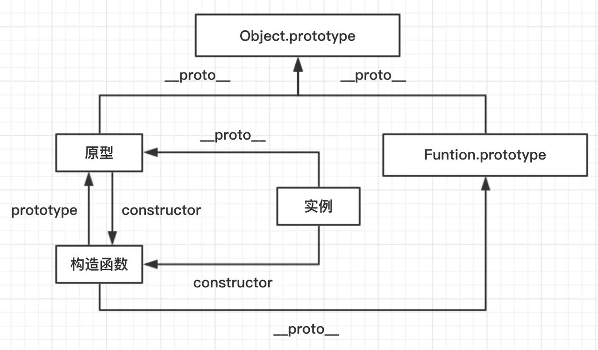

https://www.cnblogs.com/wangfupeng1988/p/3977924.html
https://github.com/xd-tayde/blog/blob/master/interview-1.md

## 原型/构造函数/实例

- 原型(prototype): 一个简单的对象用于实现对象的继承，可以理解为对象的爹，显式原型 prototype 隐式子 **proto**
- 构造函数(constructor): 可以通过 new 来新建一个 对象实例的函数, 构造函数可以通过 prototype 指向原型
- 实例(instance): 通过构造函数和 new 创建出来的对象，便是实例。 实例通过**proto**指向原型，通过 constructor 指向构造函数。

```JavaScript
实例.__proto__ === 原型

原型.constructor === 构造函数

构造函数.prototype === 原型

// 这条线其实是是基于原型进行获取的，可以理解成一条基于原型的映射线
// 例如:
// const o = new Object()
// o.constructor === Object   --> true
// o.__proto__ = null;
// o.constructor === Object   --> false
// 注意: 其实实例上并不是真正有 constructor 这个指针，它其实是从原型链上获取的
//      instance.hasOwnProperty('constructor') === false
实例.constructor === 构造函数

```

图片理解


## 原型链

原型链是由原型对象组成，每个对象都有 **proto** 属性，指向了创建该对象的构造函数的原型，**proto** 将对象连接起来组成了原型链。是一个用来实现继承和共享属性的有限的对象链。

- 属性查找机制: 当查找对象的属性时，如果实例对象自身不存在该属性，则沿着原型链往上一级查找，找到时则输出，不存在时，则继续沿着原型链往上一级查找，直至最顶级的原型对象 Object.prototype，如还是没找到，则输出 undefined；
- 属性修改机制: 只会修改实例对象本身的属性，如果不存在，则进行添加该属性，如果需要修改原型的属性时，则可以用: b.prototype.x = 2；但是这样会造成所有继承于该对象的实例的属性发生改变。

## instanceof

instanceof 运算符用于测试构造函数的 prototype 属性是否出现在对象原型链中的任何位置

```
instance.[__proto__...] === constructor.prototype
```

https://segmentfault.com/a/1190000018874474

## new 运算符的执行过程

```JavaScript
new People('12') = {
  var obj = {} 或者 var obj = new Object() // 创建一个空对象;
  obj.__proto__ = People.prototype // 将该隐式原型原型指向构造函数显式原型，建立对象和原型直接的对应关系。
  People.call(obj, "12") // 将构造函数中this指向创建的obj对象，并传入参数"12"
  return obj // 返回obj对象，person指向创建的obj对象(对象类型赋值为按引用传递，obj与person指向同一个对象)
}
```

## 执行上下文

执行上下文可以简单理解为一个对象的进栈道、出栈的过程

- 包含 3 个部分
  - 变量对象, 变量、函数表达式——变量声明，默认赋值为 undefined；`变量提升`
  - this——赋值；
  - 作用域链(词法作用域)
- 代码段分为 3 种类型
  - 全局代码
  - 函数体
  - eval 代码
- 代码执行过程:
  - 创建 全局上下文 (global EC)
  - 全局执行上下文 (caller) 逐行 自上而下 执行。遇到函数时，函数执行上下文 (callee) 被 push 到执行栈顶层
  - 函数执行上下文被激活，成为 active EC, 开始执行函数中的代码，caller 被挂起
  - 函数执行完后，callee 被 pop 移除出执行栈，控制权交还全局上下文 (caller)，继续执行

## 变量对象

变量对象，是执行上下文中的一部分，可以抽象为一种 数据作用域，其实也可以理解为就是一个简单的对象，它存储着该执行上下文中的所有 变量和函数声明

## 作用域

执行上下文中还包含作用域链。理解作用域之前，先介绍下作用域。作用域其实可理解为该上下文中声明的 变量和声明的作用范围。

- `创建这个函数的那个作用域中取值——是“创建”，而不是“调用”，切记切记`。
- 声明提前: 一个声明在函数体内都是可见的, 函数优先于变量
- 非匿名自执行函数，函数变量为`只读`状态，无法修改
  ```JavaScript
    let foo = function(){console.log(1)}
    (function foo(){
      foo = 10 // 由于foo 在函数中 `只读` 状态，赋值无效
      console.log(foo)
    }())
    // 结果打印: f foo(){foo=10;console.log(foo)}
  ```

## 作用域链

我们知道，我们可以在执行上下文中访问到父级甚至全局的变量，这便是作用域链的功劳。作用域链可以理解为一组对象列表，包含 父级和自身的变量对象，因此我们便能通过作用域链访问到父级里声明的变量或者函数。

由两部分组成

- 父级的 scope
- AO: 自身的变量

自上而下的作用域链

## 闭包

闭包属于一种特殊的作用域，称为 `静态作用域`。它的定义可以理解为: `父函数被销毁` 的情况下，返回出的`子函数`的[[scope]]中仍然保留着父级的单变量对象和作用域链，因此可以继续访问到父级的变量对象，这样的函数称为闭包。

- 函数作为返回值
  ```JavaScript
    function makeFunc() {
      var name = "Mozilla";
      function displayName() {
          alert(name);
      }
      return displayName;
    }
    var myFunc = makeFunc(); // 执行完成这里按理说要销毁makeFunc作用域的，但是返回的displayName引用了 makeFunc作用域 所以不能删除，导致一直占用内存
    myFunc();
  ```
- 函数作为参数传递
  ```JavaScript
    var max = 10
    var fn = function(x){
      console.log(x + max) // 25 变量取自声明，切记切记
    }
    (function(f){
      var max = 100;
      f(15)
    }(fn))
  ```

解决:

- 变量可以通过 函数参数的形式 传入，避免使用默认的[[scope]]向上查找
- 使用 setTimeout 包裹，通过第三个参数传入
- 使用 块级作用域，让变量成为自己上下文的属性，避免共享

## this/call/apply/bind

由于 JS 的设计原理: 在函数中，可以引用运行环境中的变量。因此就需要一个机制来让我们可以在函数体内部获取当前的运行环境，这便是`this`。

因此要明白 this 指向，其实就是要搞清楚 函数的运行环境，说人话就是，谁调用了函数。例如:

- 如果函数作为构造函数用，那么其中的 `this` 就代表它即将 `new` 出来的对象

```JavaScript
  function Person(){
    this.name = 'rzp';
    console.log(this); // {name:'rzp'}
  }
  var rzp = new Person();
  console.log(rzp.name) // rzp
```

- 上述 如果仅调用，不 `new` 的话, 指向 `window`
  ```JavaScript
    function Person(){
      this.name = 'rzp';
      console.log(this); // Window
    }
    Person()
  ```
- `obj.fn()`，便是 `obj` 调用了函数，既函数中的 `this === obj`
- 特殊情况注意下, 内部声明不是挂载到对象上
  ```JavaScript
    var obj = {
      x: 10,
      fn: function(){
        function f(){
          console.log(this) // window
        }
        f()
      }
    }
    obj.fn()
  ```

因此提供了三种方式可以手动修改 this 的指向:

- call: fn.call(target, 1, 2) // arguments 一个一个列出来 `立即调用`
- apply: fn.apply(target, [1, 2]) // arguments 以一个数组方式实现 `立即调用`
- bind: fn.bind(target)(1,2) // arguments 一个一个列出来 `绑定函数可稍后执行`

## 代码的复用

- 函数封装
- 继承
- 复制 extend
- 混入 mixin
- 借用 apply/call

## 继承

在 JS 中，继承通常指的便是 原型链继承，也就是通过指定原型，并可以通过原型链继承原型上的属性或者方法。

- 最优化: 圣杯模式

```JavaScript
  var inherit = (function(Target,Origin){
    var F = function(){};
    return function(Target,p){
      F.prototype = Origin.prototype;
      Target.prototype = new F();
      Target.prototype.constructor = Target;  // constuctor归位
      Target.uber = Origin.prototype; // 信息储备，想知道继承自谁，先记录下来
    }
  })();
```
