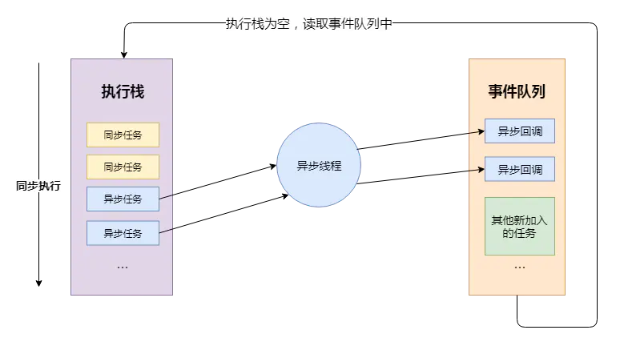
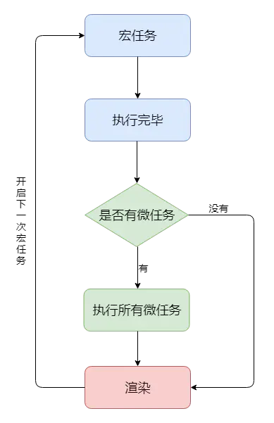

# 浏览器包括了那些进程

- 主进程
  - 协调控制其他子进程(创建，销毁)
  - 浏览器洁面现实，用户交互，前进，后退，收藏
  - 将渲染进程得到的内存中的 Bitmap,绘制到用户界面上
  - 处理不可见操作，网络请求，文件访问等
- 第三方插件进程
  - 每种类型的插件对应一个进程，仅当使用该插件时才创建
- 渲染进程，就是我们说的浏览器内核
  - 负责页面渲染，脚本执行，事件处理等
  - 每个 tab 页一个渲染进程

# 浏览器内核(渲染进程)

而对于渲染进程来说，它当然也是多线程的了，接下来我们来看一下渲染进程包含哪些线程。

- `GUI渲染线程`
  - 负责渲染页面，布局和绘制
  - 页面需要重绘和回流时，该线程就会执行
  - 与 js 引擎线程互斥，防止渲染结果不可预期
- `JS引擎线程`
  - 负责处理解析和执行 javascript 脚本程序
  - 只有一个 JS 引擎线程(单线程)
  - 与 GUI 渲染线程互斥，防止渲染结果不可预期
- `事件触发线程`
  - 用来控制事件循环(鼠标点击，setTimeout,ajax)等
  - 当事件满足触发条件的时候，将事件放入到 JS 引擎所在的执行队列中
- `定时触发线程`
  - setInterval 与 setTimeout 所在的线程
  - 定时任务并不是由 JS 引擎计时的，是由定时触发线程来计时的
  - 计时完毕后，通知事件触发线程
- `异步Http请求线程`
  - 浏览器有一个单独的线程用于处理 AJAX 请求
  - 当请求完成时，若有回调函数，通知事件触发线程

# 为什么 javascript 是单线程的

- 首先是历史原因，在创建 javascript 这门语言时，多进程多线程的架构并不流行，硬件支持并不好。
- 其次是因为多线程的复杂性，多线程操作需要加锁，编码的复杂性会增高。
- 而且，如果同时操作 DOM ，在多线程不加锁的情况下，最终会导致 DOM 渲染的结果不可预期。

# 为什么 GUI 渲染线程与 JS 引擎线程互斥

这是由于 JS 是可以操作 DOM 的，如果同时修改元素属性并同时渲染界面(即 JS 线程和 UI 线程同时运行)，
那么渲染线程前后获得的元素就可能不一致了。
因此，为了防止渲染出现不可预期的结果，浏览器设定 GUI 渲染线程和 JS 引擎线程为互斥关系，
当 JS 引擎线程执行时 GUI 渲染线程会被挂起，GUI 更新则会被保存在一个队列中等待 JS 引擎线程空闲时立即被执行。

# 从 Event Loop 看 JS 的运行机制

- JS 分为 `同步任务` 和 `异步任务`
- 同步任务都在 JS 引擎线程上执行，形成一个`执行栈`
- 事件触发线程管理一个`事件队列`，异步任务触发条件达成，将回调事件放到`事件队列`中
- 执行栈中所有同步任务执行完毕，此时 JS 引擎线程空闲，系统会读取任务队列，将可运行的异步任务回调事件添加到执行栈中，开始执行



## setTimeout/setInterval/XHR/fetch

- 当代码执行到`setTimeout/setInterval`时，实际上是`JS引擎线程`通知`定时触发器线程`，间隔一个时间后，会触发一个回调事件， 而`定时触发器线程`在接收到这个消息后，会在等待的时间后，将`回调事件`放入到由`事件触发线程`所管理的`事件队列`中。
  - JS 通知->定时触发线程->完成->事件队列->JS 空闲->拉取->执行(先进先出)
- 当代码执行到 XHR/fetch 时，实际上是 JS 引擎线程通知异步 http 请求线程，发送一个网络请求，并制定请求完成后的回调事件， 而异步 http 请求线程在接收到这个消息后，会在请求成功后，将回调事件放入到由事件触发线程所管理的事件队列中。

```Javascript
  let timerCallback = function() {
    console.log('wait one second');
  };
  let httpCallback = function() {
    console.log('get server data success');
  }

  // 同步任务
  console.log('hello');
  // 同步任务
  // 通知定时器线程 1s 后将 timerCallback 交由事件触发线程处理
  // 1s 后事件触发线程将 timerCallback 加入到事件队列中
  setTimeout(timerCallback,1000);
  // 同步任务
  // 通知异步http请求线程发送网络请求，请求成功后将 httpCallback 交由事件触发线程处理
  // 请求成功后事件触发线程将 httpCallback 加入到事件队列中
  $.get('www.xxxx.com',httpCallback);
  // 同步任务
  console.log('world');
  //...
  // 所有同步任务执行完后
  // 询问事件触发线程在事件事件队列中是否有需要执行的回调函数
  // 如果没有，一直询问，直到有为止
  // 如果有，将回调事件加入执行栈中，开始执行回调代码
```

# 宏任务、微任务

## 宏任务

我们可以将每次执行栈执行的代码当做是一个宏任务（包括每次从事件队列中获取一个事件回调并放到执行栈中执行）， 每一个宏任务会从头到尾执行完毕，不会执行其他。

我们前文提到过 JS 引擎线程和 GUI 渲染线程是互斥的关系，浏览器为了能够使宏任务和 DOM 任务有序的进行，会在一个宏任务执行结果后，在下一个宏任务执行前，GUI 渲染线程开始工作，对页面进行渲染。

主代码块，setTimeout，setInterval 等，都属于宏任务

// 宏任务-->渲染-->宏任务-->渲染-->渲染．．．

## 微任务

我们已经知道宏任务结束后，会执行渲染，然后执行下一个宏任务，
而微任务可以理解成在当前宏任务执行后立即执行的任务。

也就是说，当宏任务执行完，`会在渲染前，将执行期间所产生的所有微任务都执行完。`

Promise，ajax 等，属于微任务。

# 总结

- 执行一个宏任务（栈中没有就从事件队列中获取）
- 执行过程中如果遇到微任务，就将它添加到微任务的任务队列中
- 宏任务执行完毕后，立即执行当前微任务队列中的所有微任务（依次执行）
- 当前宏任务执行完毕，开始检查渲染，然后 GUI 线程接管渲染
- 渲染完毕后，JS 线程继续接管，开始下一个宏任务（从事件队列中获取）



https://juejin.cn/post/6844903919789801486
