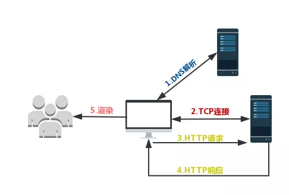
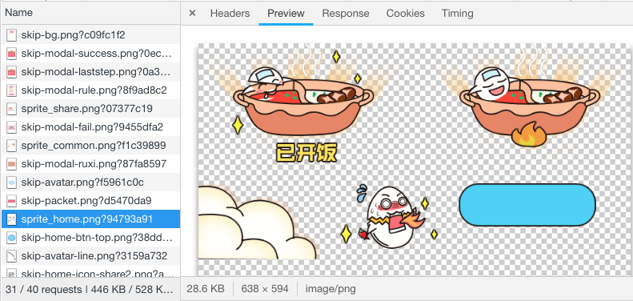
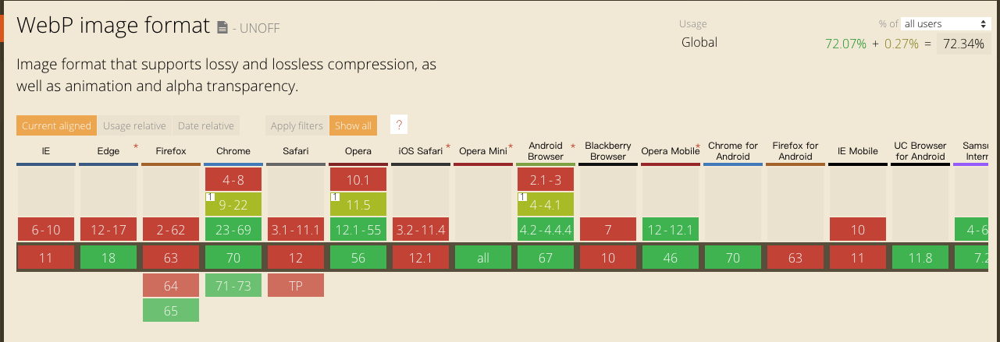
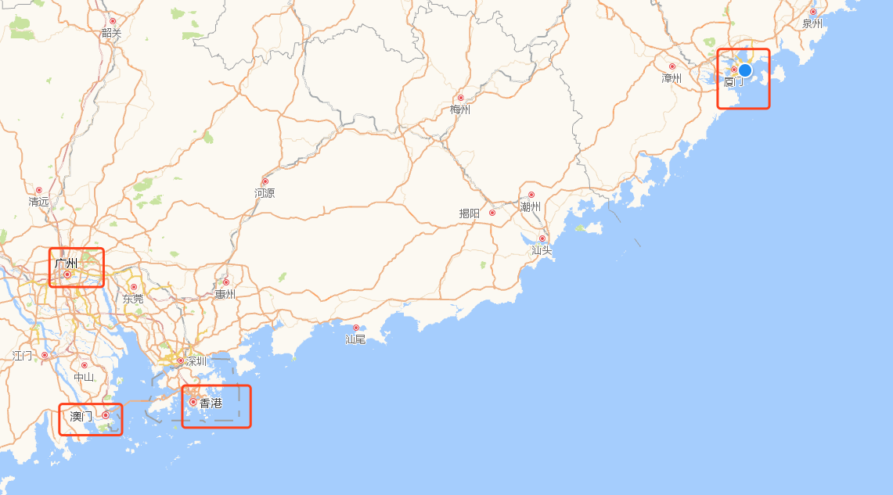

# 前端性能优化和实践

## 目录
[TOC]

## 前言

从一道老生常谈的问题说起

> 从输入 URL 到页面加载完成，发生了什么？

我们现在站在性能优化的角度，过程是这样的：

1. 通过 `DNS`（域名解析系统）将 `URL` 解析为对应的 IP 地址；
2. 与这个 `IP` 地址确定的那台服务器建立起 `TCP` 网络连接；
3. 向服务端抛出我们的 `HTTP` 请求；
4. 服务端处理完我们的请求之后，把目标数据放在 `HTTP` 响应里返回给客户端；
5. 客户端拿到响应数据后浏览器就开始走渲染流程；
  - HTML parser --> DOM Tree
    - 标记化算法，进行元素状态的标记
    - dom 树构建
  - CSS parser --> Style Tree
    - 解析 css 代码，生成样式树
  - attachment --> Render Tree
    - 结合 dom树 与 style树，生成渲染树
  - layout: 布局
  - GPU painting: 像素绘制页面
6. 渲染完毕，页面便呈现给了用户，并时刻等待响应用户的操作。



如果说在这个流程中 `DNS` 解析和 `TCP` 的优化往往需要服务端和运维来完成，前端能做的有限。但在 `HTTP` 请求呢？——在减少请求次数和减小请求体积方面，我们应该是专家。再者，服务器越远，一次请求就越慢，那部署时就把静态资源放在离我们更近的 `CDN` 上是不是就能更快一些？

以上都是网络层面的性能优化。再往下就是浏览器端的性能优化，这部分涉及：
- 资源加载优化
- 服务端渲染
- 浏览器缓存机制
- `DOM` 树的构建
- 网页排版和渲染过程
- 回流与重绘的考量
- `DOM` 操作的合理规避

这几个方面都是前端工程师可以真正一展拳脚的地方，学习这些方面不仅可以帮助我们从根本上提升页面性能，更能够大大加深个人对浏览器底层原理、运行机制的理解。

参考资料：
- [前端性能优化最佳实践](https://csspod.com/frontend-performance-best-practices/)

## webpack 性能调优

对于 `DNS` 解析和 `TCP` 连接两个步骤，我们前端可以做的努力非常有限。相比之下，`HTTP` 连接这一层面的优化才是我们网络优化的核心。

HTTP 优化有两个大的方向：

- 减少请求次数
- 减少单次请求所花费的时间

这两个优化点指向了我们日常开发中非常常见的操作——资源的压缩与合并，就是我们每天用构建工具在做的事情。而时下最主流的构建工具无疑是 `webpack`。

### webpack的性能瓶颈

`webpack` 的优化瓶颈，主要是两个方面：

- `webpack` 的构建过程太花时间
- `webpack` 打包的结果体积太大

### 不要让 loader 做太多事情

以 `babel-loader` 为例 `babel-loader` 无疑是强大的，但它也是慢的。

最常见的优化方式是，用 `include` 或 `exclude` 来帮我们避免不必要的转译，比如 `webpack` 官方在介绍 `babel-loader` 时给出的示例：

传送门：[babel-loader](https://github.com/babel/babel-loader)

```js
module: {
  rules: [
    {
      test: /\.m?js$/,
      exclude: /(node_modules|bower_components)/,
      use: {
        loader: 'babel-loader',
        options: {
          presets: ['@babel/preset-env']
        }
      }
    }
  ]
}
```

这段代码帮我们规避了对庞大的 `node_modules` 文件夹或者 `bower_components` 文件夹的处理。但通过限定文件范围带来的性能提升是有限的。除此之外，如果我们选择开启缓存将转译结果缓存至文件系统，则至少可以将 `babel-loader` 的工作效率提升两倍。要做到这点，我们只需要为 `loader` 增加相应的参数设定：

```js
loader: 'babel-loader?cacheDirectory=true'
```
以上都是针对 `loader` 的配置，但我们的优化范围不止是 `loader` 们。

### 将 webpack 由单进程转为多进程

`webpack` 是单线程的，就算此刻存在多个任务，你也只能排队一个接一个地等待处理。这是 `webpack` 的缺点，但我们的 `CPU` 是多核的，可以利用类似的工具像是 [HappyPack](https://github.com/amireh/happypack) 帮我们把任务分解给多个子进程去并发执行，提升打包效率。

[HappyPack](https://github.com/amireh/happypack) 的使用方法是把对 `loader` 的配置转移到 `HappyPack` 中去，我们可以手动告诉 `HappyPack` 我们需要多少个并发的进程：

```js
const HappyPack = require('happypack')
// 手动创建进程池
const happyThreadPool =  HappyPack.ThreadPool({ size: os.cpus().length })

module.exports = {
  module: {
    rules: [
      ...
      {
        test: /\.js$/,
        // 问号后面的查询参数指定了处理这类文件的HappyPack实例的名字
        loader: 'happypack/loader?id=happyBabel',
        ...
      },
    ],
  },
  plugins: [
    ...
    new HappyPack({
      // 这个HappyPack的“名字”就叫做happyBabel，和楼上的查询参数遥相呼应
      id: 'happyBabel',
      // 指定进程池
      threadPool: happyThreadPool,
      loaders: ['babel-loader?cacheDirectory']
    })
  ],
}...
```

### 文件结构可视化，找出导致体积过大的原因

[webpack-bundle-analyzer](https://www.npmjs.com/package/webpack-bundle-analyzer)，配置方法和普通的 `plugin` 无异，它会以矩形树图的形式将包内各个模块的大小和依赖关系呈现出来，格局如官方所提供这张图所示：


在使用时，我们只需要将其以插件的形式引入：

```js
const BundleAnalyzerPlugin = require('webpack-bundle-analyzer').BundleAnalyzerPlugin;
 
module.exports = {
  plugins: [
    new BundleAnalyzerPlugin()
  ]
}
```

### 按需加载

比如有一个场景，我们用 `Vue` 构建了一个单页应用，用 `Vue-Router` 来控制路由，十个路由对应了十个页面，这十个页面都不简单。如果我把这整个项目打一个包，用户打开我的网站时，有很大几率会非常慢，这时候我们就会需要按需加载的思想。
- 一次不加载完所有的文件内容，只加载此刻需要用到的那部分
- 当需要更多内容时，再对用到的内容进行即时加载

传送门：[Vue-Router路由懒加载](https://router.vuejs.org/zh/guide/advanced/lazy-loading.html)


## Gzip 压缩原理

我们日常开发中，其实还有一个便宜又好用的压缩操作：开启 `Gzip`

具体的做法是在你的 `request headers` 中加上这么一句：

```js
Accept-Encoding: gzip
```
### 百科的解释
> HTTP 压缩是一种内置到网页服务器和网页客户端中以改进传输速度和带宽利用率的方式。在使用 HTTP 压缩的情况下，HTTP 数据在从服务器发送前就已压缩：兼容的浏览器将在下载所需的格式前宣告支持何种方法给服务器；不支持压缩方法的浏览器将下载未经压缩的数据。最常见的压缩方案包括 Gzip 和 Deflate。

总结来说就是：++HTTP 压缩就是以缩小体积为目的，对 HTTP 内容进行重新编码的过程++

Gzip 的内核就是 Deflate，目前我们压缩文件用得最多的就是 Gzip。

### 该不该用 Gzip

如果项目不是特别极端的超小文件，都建议使用 Gzip。

实践证明，虽然压缩 Gzip，服务端要花时间；解压 Gzip，浏览器要花时间。我们获得的只有中间节省出来的传输时间。

但是如果我们处理的都是具备一定规模的项目文件，这种情况下压缩和解压带来的时间开销相对于传输过程中节省下的时间开销来说，可以说是微不足道的。

### Gzip 是万能的吗

Gzip 是高效的，在压缩后通常能帮我们减少响应 70% 左右的大小。

但它并非万能的。Gzip 并不保证针对每一个文件的压缩都会使其变小。

因为 Gzip 压缩背后的原理，是在一个文本文件中找出一些重复出现的字符串、临时替换它们，从而使整个文件变小。根据这个原理，文件中代码的重复率越高，那么压缩的效率就越高，使用 Gzip 的收益也就越大。

## 图片优化

时下应用较为广泛的 Web 图片格式有 JPEG/JPG、PNG、WebP、Base64、SVG 等，这些格式都各有特点。此外雪碧图（CSS Sprites）至今也仍在一线的前端应用中发光发热。

### 二进制位数与色彩的关系

在计算机中，像素用二进制数来表示。不同的图片格式中像素与二进制位数之间的对应关系是不同的。一个像素对应的二进制位数越多，它可以表示的颜色种类就越多，成像效果也就越细腻，文件体积相应也会越大。

一个二进制位表示两种颜色（0|1 对应黑|白），如果一种图片格式对应的二进制位数有 n 个，那么它就可以呈现 2^n 种颜色。

### JPG/JPEG

#### 特点
有损压缩、体积小、加载快、不支持透明

#### 使用场景
适用于呈现色彩丰富的图片，在我们日常开发中，JPG 图片经常作为大的背景图、轮播图或 Banner 图出现。

#### 缺点
当它处理矢量图形和 Logo 等线条感较强、颜色对比强烈的图像时，人为压缩导致的图片模糊会相当明显，并且 JPG 不支持透明度处理，透明图片需要使用 PNG 来呈现。

### PNG 
PNG 图片具有比 JPG 更强的色彩表现力，对线条的处理更加细腻，对透明度有良好的支持。

#### 特点
无损压缩、质量高、体积大、支持透明明

#### 使用场景
考虑到 PNG 在处理线条和颜色对比度方面的优势，我们主要用它来呈现小的 Logo、颜色简单且对比强烈的图片或背景等。

#### 缺点
体积太大。

### SVG
SVG（可缩放矢量图形）是一种基于 XML 语法的图像格式。它和本文提及的其它图片种类有着本质的不同：SVG 对图像的处理不是基于像素点，而是是基于对图像的形状描述。

由于 SVG 图片可无限放大而不失真这一点上。这使得 SVG 即使是被放到视网膜屏幕上，也可以一如既往地展现出较好的成像品质——1 张 SVG 足以适配 n 种分辨率。

此外，SVG 是文本文件。我们既可以像写代码一样定义 SVG，把它写在 HTML 里、成为 DOM 的一部分，也可以把对图形的描述写入以 .svg 为后缀的独立文件（SVG 文件在使用上与普通图片文件无异）。这使得 SVG 文件可以被非常多的工具读取和修改，具有较强的灵活性。

#### 特点
文本文件、体积小、不失真、兼容性好

#### 使用方式
将 SVG 写入 HTML

```html
<!DOCTYPE html>
<html lang="en">
    <head>
        <meta charset="UTF-8">
        <title></title>
    </head>
    <body>
        <svg xmlns="http://www.w3.org/2000/svg" width="200" height="200">
            <circle cx="50" cy="50" r="50" />
        </svg>
    </body>
</html>
```


#### 缺点
SVG 的局限性主要有两个方面，一方面是它的渲染成本比较高，这点对性能来说是很不利的。另一方面，SVG 存在着其它图片格式所没有的学习成本（它是可编程的）

#### 在线矢量图形库

[iconfont](http://www.iconfont.cn/)

#### svg-sprite

利用 svg 的 symbol 标签的 id 和 use 标签的 xlink:href 属性对应的关系。将多个图标作为 symbol 写在同一个 svg 内，在后续的 html 结构中引用。

传送门：[svg-sprite-loader](https://note.youdao.com/)

在html顶部区域定义一个隐藏的svg标签：

```html
<svg xmlns="http://www.w3.org/2000/svg" xmlns:xlink="http://www.w3.org/1999/xlink" style="position: absolute; width: 0; height: 0">
    <symbol viewBox="0 0 1024 1024" id="logo1">
        <path>...</path> 
    </symbol>
    <symbol viewBox="0 0 1024 1024" id="logo2">
        <path>...</path> 
    </symbol>
</svg>
```

在后续的html结构中引用：

```html
<svg>
    <use xlink:href="#logo1"></use>
</svg>

<svg>
    <use xlink:href="#logo2"></use>
</svg>
```

### 雪碧图（CSS Sprites）

雪碧图、CSS 精灵、CSS Sprites、图像精灵，说的都是这个东西 —— 一种将小图标和背景图像合并到一张图片上，然后利用 CSS 的背景定位来显示其中的每一部分的技术，它是最经典的小图标解决方案。

MDN的解释是：

>图像精灵（sprite，意为精灵），被运用于众多使用大量小图标的网页应用之上。它可取图像的一部分来使用，使得使用一个图像文件替代多个小文件成为可能。相较于一个小图标一个图像文件，单独一张图片所需的 HTTP 请求更少，对内存和带宽更加友好。...




### Base64

和雪碧图一样，Base64 图片的出现，也是为了减少加载网页图片时对服务器的请求次数，从而提升网页性能。

Base64 是一种用于传输 8Bit 字节码的编码方式，通过对图片进行 Base64 编码，我们可以直接将编码结果写入 HTML 或者写入 CSS，从而减少 HTTP 请求的次数。

#### Base64 应用场景

由于 Base64 编码后，图片大小会膨胀为原文件的 4/3，如果我们把大图也编码到 HTML 或 CSS 文件中，后者的体积会明显增加，即便我们减少了 HTTP 请求，也无法弥补这庞大的体积带来的性能开销，得不偿失。

在传输非常小的图片的时候，Base64 带来的文件体积膨胀、以及浏览器解析 Base64 的时间开销，与它节省掉的 HTTP 请求开销相比，可以忽略不计。

因此，是否对一张图片使用 Base64 编码应满足如下条件：

- 图片的实际尺寸很小
- 图片无法以雪碧图的形式与其它小图结合
- 图片的更新频率非常低（不需我们重复编码和修改文件内容，维护成本较低）

#### Base64 编码工具 url-loader

webpack 的 [url-loader](https://github.com/webpack-contrib/url-loader) 除了具备基本的 Base64 转码能力，还可以结合文件大小，帮我们判断图片是否有必要进行 Base64 编码。

### WebP

 WebP 是 Google 专为 Web 开发的一种旨在加快图片加载速度的图片格式，它支持有损压缩和无损压缩。
 
 #### 优点
 WebP 像 JPEG 一样擅长处理细节丰富的图片，像 PNG 一样支持透明，像 GIF 一样可以显示动态图片 —— 它集多种图片文件格式的优点于一身。
 
#### 局限性
兼容性是它最大的问题，最有效的办法是判断当前环境是否支持 webp 从而对 webp 格式的图片做兼容，如果有图床的话将会很容易做到，比如七牛的话可以加上`/format/webp`后缀

- [WebP图片兼容性处理](https://github.com/RicardoCao-Biker/RICO-BLOG/issues/9)
- [webp图片适配流量优化](https://juejin.im/post/58b526db8d6d810057639c6f)



## 本地存储

### Cookie

Cookie 的本职工作并非本地存储，而是“维持状态”。

Cookie 可以理解为就是一个存储在浏览器里的一个小小的文本文件，它附着在 HTTP 请求上，在浏览器和服务器之间“传递”。它可以携带用户信息，当服务器检查 Cookie 的时候，便可以获取到客户端的状态。

所以 Cookie 被广泛用于客户端和服务端的权限认证上。

#### Cookie的性能劣势

- **Cookie 是有体积上限的**：它最大只能有 4KB。当 Cookie 超过 4KB 时，它将被裁切。所以，Cookie 只能用来存取少量的信息。
- **Cookie 是紧跟域名的**：同一个域名下的所有请求，都会携带 Cookie，过量的 Cookie 会带来巨大的性能浪费，如果我们此刻仅仅是请求一张图片或者一个 CSS 文件，我们也要携带一个 Cookie （关键是 Cookie 里存储的信息我现在并不需要），是多么浪费的事情。Cookie 虽然小，请求却可以有很多，随着请求的叠加，这样的不必要的 Cookie 带来的开销将是无法想象的，这也是现在的很多网站网页资源和多媒体资源不在一个域名下的原因。

### Local Storage 与 Session Storage

两者的区别在于生命周期与作用域的不同。

- 生命周期：Local Storage 是持久化的本地存储，存储在其中的数据是永远不会过期的，使其消失的唯一办法是手动删除；而 Session Storage 是临时性的本地存储，它是会话级别的存储，当会话结束（页面被关闭）时，存储内容也随之被释放。

- 作用域：Local Storage、Session Storage 和 Cookie 都遵循同源策略。但 Session Storage 特别的一点在于，即便是相同域名下的两个页面，只要它们不在同一个浏览器窗口中打开，那么它们的 Session Storage 内容便无法共享。

#### 特性

- 存储容量大： Local Storage 与 Session Storage 根据浏览器的不同，存储容量可以达到 5-10M 之间。

- 仅位于浏览器端，不与服务端发生通信。

## CDN 的缓存与回源机制解析

> CDN （Content Delivery Network，即内容分发网络）指的是一组分布在各个地区的服务器。这些服务器存储着数据的副本，因此服务器可以根据哪些服务器与用户距离最近，来满足数据的请求。 CDN 提供快速服务，较少受高流量影响。

### 为什么要用 CDN

为了要提升首次请求的响应能力。

### CDN 如何工作



假设我的根服务器在厦门，同时在图示的所有城市里都有自己可用的机房。

此时有一位深圳的用户向我请求资源。在网络带宽小、用户访问量大的情况下，厦门的这一台服务器或许不能及时给出响应，但如果我把资源copy了一份放在广州的服务器上，当用户请求资源时，就近请求广州的服务器。由于距离的原因，响应速度肯定比在厦门的服务器快。如果广州这台服务器没有 copy 这批资源，它会再向厦门的根服务器去要这个资源。这个过程中，广州的服务器就扮演CDN的角色。

### CDN的核心功能

CDN 的核心点有两个，一个是缓存，一个是回源。

“缓存”就是说我们把资源 copy 一份到 CDN 服务器上这个过程，“回源”就是说 CDN 发现自己没有这个资源（一般是缓存的数据过期了），转头向根服务器（或者它的上层服务器）去要这个资源的过程。

### CDN 与前端性能优化

CDN 往往被用来存放**静态资源**。上文提到的“根服务器”本质上是业务服务器，它的核心任务在于生成动态页面或返回非纯静态页面，这两种过程都是需要计算的。业务服务器仿佛一个车间，车间里运转的机器轰鸣着为我们产出所需的资源；相比之下，CDN 服务器则像一个仓库，它只充当资源的“栖息地”和“搬运工”。

**“静态资源”** 就是像 JS、CSS、图片等不需要业务服务器进行计算即得的资源。而“动态资源”，顾名思义是需要后端实时动态生成的资源，较为常见的就是 JSP、ASP、PHP 或者依赖服务端渲染得到的 HTML 页面。

**“非纯静态资源”** 它是指需要服务器在页面之外作额外计算的 HTML 页面。具体来说，当我打开某一网站之前，该网站需要通过权限认证等一系列手段确认我的身份、进而决定是否要把 HTML 页面呈现给我。这种情况下 HTML 确实是静态的，但它和业务服务器的操作耦合，我们把它丢到CDN上是不合适的

### CDN 的实际应用

静态资源本身具有访问频率高、承接流量大的特点，因此静态资源加载速度始终是前端性能的一个非常关键的指标。CDN 是静态资源提速的重要手段。

### CDN 优化细节

由于同一个域名下的请求会自发地携带 Cookie，而静态资源往往并不需要 Cookie 携带什么认证信息。把静态资源和主页面置于不同的域名下，完美地避免了不必要的 Cookie 的出现。

拿电商网站来举例，电商网站静态资源的流量之庞大，如果没把这个多余的 Cookie 拿下来，不仅用户体验会大打折扣，每年因性能浪费带来的经济开销也将是一个非常恐怖的数字。

## DOM优化

我们主要关注两大问题 “DOM 为什么这么慢”以及“如何使 DOM 变快”。

### DOM 为什么这么慢？

> 把 DOM 和 JavaScript 各自想象成一个岛屿，它们之间用收费桥梁连接。——《高性能 JavaScript》

JS 是很快的，在 JS 中修改 DOM 对象也是很快的。在JS的世界里，一切是简单的、迅速的。DOM 操作并非 JS d单方面的操作，而是两个模块之间的协作。

JS 引擎和渲染引擎（浏览器内核）是独立实现的。当我们用 JS 去操作 DOM 时，本质上是 JS 引擎和渲染引擎之间进行了“跨界交流”。这个“跨界交流”的实现并不简单，它依赖了桥接接口作为“桥梁”。

过“桥”要收费——这个开销本身就是不可忽略的。我们每操作一次 DOM（不管是为了修改还是仅仅为了访问其值），都要过一次“桥”。过“桥”的次数一多，就会产生比较明显的性能问题。因此“减少 DOM 操作”对性能的提升是很明显的。

### 对 DOM 的修改引发样式的更迭

我们对 DOM 的操作都不会局限于访问，而是为了修改它。当我们对 DOM 的修改会引发它外观（样式）上的改变时，就会触发回流或重绘。

- 回流：当我们对 DOM 的修改引发了 DOM 几何尺寸的变化（比如修改元素的宽、高或隐藏元素等）时，浏览器需要重新计算元素的几何属性（其他元素的几何属性和位置也会因此受到影响），然后再将计算的结果绘制出来。这个过程就是回流（也叫重排）。

- 重绘：当我们对 DOM 的修改导致了样式的变化、却并未影响其几何属性（比如修改了颜色或背景色）时，浏览器不需重新计算元素的几何属性、直接为该元素绘制新的样式（跳过了上图所示的回流环节）。这个过程叫做重绘。

因此：++重绘不一定导致回流，回流一定会导致重绘++，回流比重绘做的事情更多，带来的开销也更大。我们在开发中，要从代码层面出发，尽可能把回流和重绘的次数最小化。

### 减少 DOM 操作：少交“过路费”、避免过度渲染

```html
<!DOCTYPE html>
<html lang="en">
<head>
  <meta charset="UTF-8">
  <meta name="viewport" content="width=device-width, initial-scale=1.0">
  <meta http-equiv="X-UA-Compatible" content="ie=edge">
  <title>DOM操作</title>
</head>
<body>
  <div id="container"></div>
</body>
</html>
```

有个需求，需要在 container 元素里写一万句同样的话


```js
for(var count=0;count<10000;count++){ 
  document.getElementById('container').innerHTML+='<span>同样的话</span>'
} 
```

我们每一次循环都调用 DOM 接口重新获取了一次 container 元素，相当于每次循环都交了一次过路费。前后交了 10000 次过路费，但其中 9999 次过路费都可以用缓存变量的方式节省下来：

```js
let container = document.getElementById('container')
for(let count=0;count<10000;count++){ 
  container.innerHTML += '<span>同样的话</span>'
}
```
但是不必要的 DOM 更改太多了。我们的 10000 次循环里，修改了 10000 次 DOM 树。对 DOM 的修改会引发渲染树的改变、进而去走一个回流或重绘的过程，而这个过程的开销是很大的。

```js
let container = document.getElementById('container')
let content = ''
for(let count=0;count<10000;count++){ 
  // 先对内容进行操作
  content += '<span>同样的话</span>'
} 
// 内容处理好了,最后再触发DOM的更改
container.innerHTML = content
```

事实上，考虑JS 的运行速度，比 DOM 快得多这个特性。我们减少 DOM 操作的核心思路，就是让 JS 去给 DOM 分压。
 
## 回流与重绘

### 哪些实际操作会导致回流与重绘

触发重绘的原因比较好识别——只要是不触发回流，但又触发了样式改变的 DOM 操作，都会引起重绘，比如背景色、文字色、可见性(可见性这里特指形如visibility: hidden这样不改变元素位置和存在性的、单纯针对可见性的操作，注意与display:none进行区分)等。

### 回流的触发

- 代价最大：改变 DOM 元素的几何属性，常见的几何属性有 width、height、padding、margin、left、top、border 等等
- 代价适中：改变 DOM 树的结构，主要指节点的增减、移动等操作
- 容易被忽略的操作：offsetTop、offsetLeft、 offsetWidth、offsetHeight、scrollTop、scrollLeft、scrollWidth、scrollHeight、clientTop、clientLeft、clientWidth、clientHeight 这些属性的获取需要**即时计算**得到，因此浏览器为了获取这些值，也会进行回流。

### 如何规避回流与重绘

#### 将操作缓存起来，避免频繁改动

比如我们要获取一个 el 元素的宽高：

```js
  // 获取el元素
  const el = document.getElementById('el')
  
  for(let i=0;i<10;i++) {
      el.style.top  = el.offsetTop  + 10 + "px";
      el.style.left = el.offsetLeft + 10 + "px";
  }
```
这样做，每次循环都需要获取多次“敏感属性”。我们可以将其以 JS 变量的形式缓存起来，待计算完毕再提交给浏览器发出重计算请求：

```js
// 缓存offsetLeft与offsetTop的值
const el = document.getElementById('el') 
let offLeft = el.offsetLeft, offTop = el.offsetTop

// 在JS层面进行计算
for(let i=0;i<10;i++) {
  offLeft += 10
  offTop  += 10
}

// 一次性将计算结果应用到DOM上
el.style.left = offLeft + "px"
el.style.top = offTop  + "px"
```

#### 避免逐条改变样式，使用类名去合并样式

就是我们将需要多次改动样式的操作用样式来代替，通过改变class的方式来触发，这样等于我们将所有的更改一次性发出，用一个 style 请求解决掉了。

#### 将 DOM “离线”

回流和重绘，都是在“该元素位于页面上”的前提下会发生的。一旦我们给元素设置 display: none，将其从页面上“拿掉”，那么我们的后续操作，将无法触发回流与重绘——这个将元素“拿掉”的操作，就叫做 DOM 离线化。

```js
let container = document.getElementById('container')
container.style.display = 'none'
container.style.width = '100px'
container.style.height = '200px'
container.style.border = '10px solid red'
container.style.color = 'red'
container.style.display = 'block'
```

## 事件的节流和防抖

scroll 事件是一个非常容易被反复触发的事件。其实不止 scroll 事件，resize 事件、鼠标事件（比如 mousemove、mouseover 等）、键盘事件（keyup、keydown 等）都存在被频繁触发的风险。

频繁触发回调导致的大量计算会引发页面的抖动甚至卡顿。为了规避这种情况，我们需要一些手段来控制事件被触发的频率。就是在这样的背景下，throttle（事件节流）和 debounce（事件防抖）出现了。